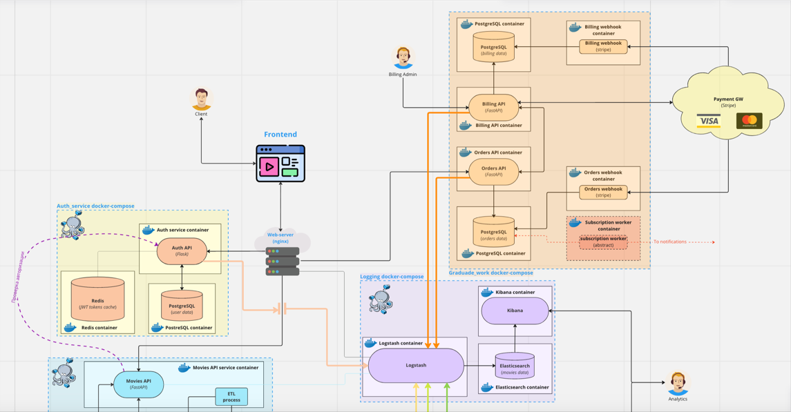
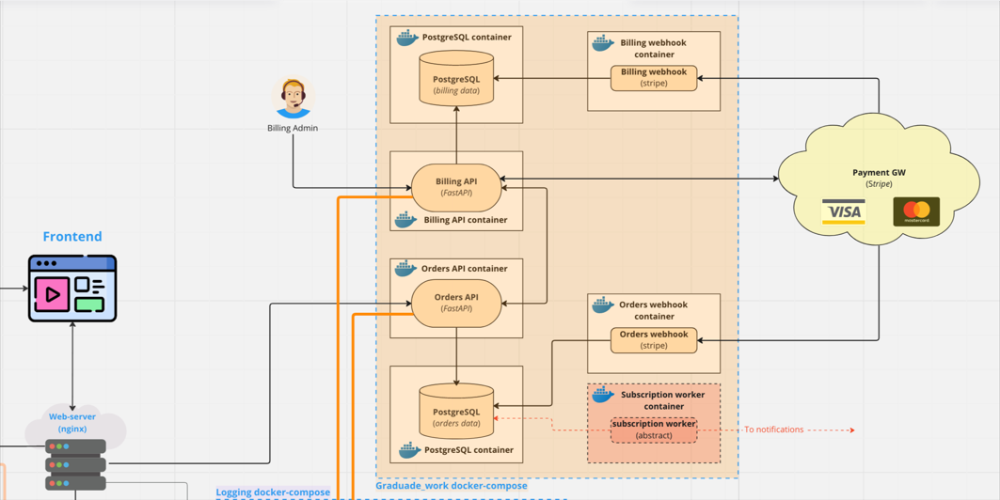
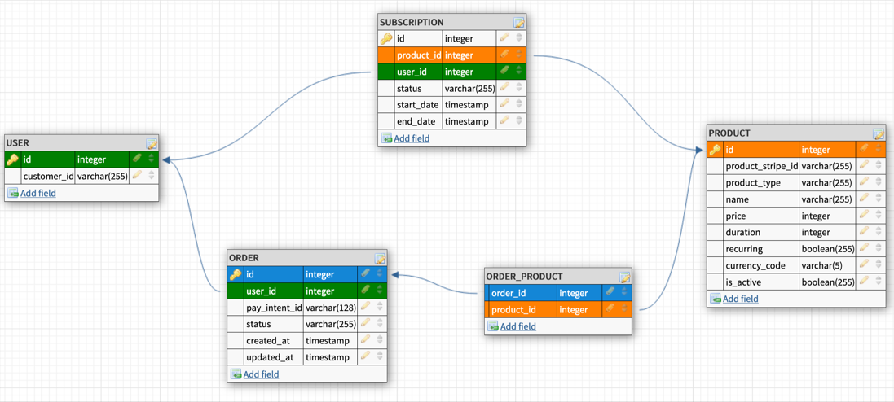
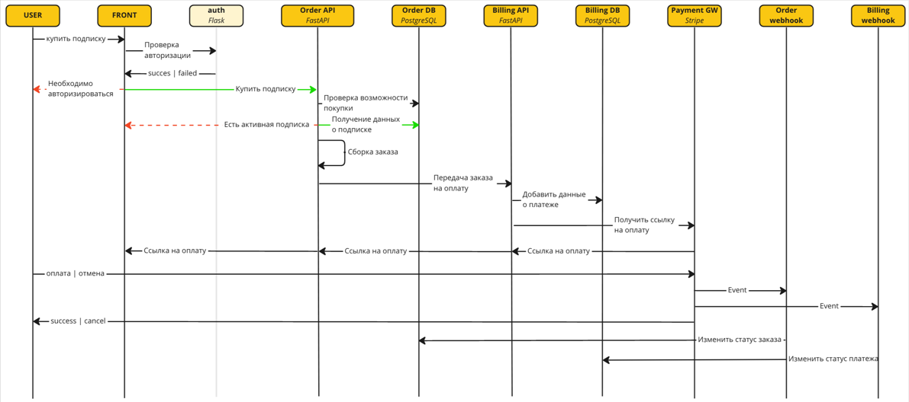

# Проектная работа: диплом
### Тема работы: биллинг.

Запуск проекта
* > make run
* > make migrate

### Схема проекта:

### Схема БД:

### Пайплайн:
* Наполнить таблицу **Product**.
* Пользователь на frontend выбирает товар (подписку) для покупки и 
нажимает кнопку **Купить**
* Поступает запрос в Order API на покупку товара. 
Проверку авторизации пользователя выполняет сервис авторизации. В текущей реализации сделан мок.
* Сервис Order API выполняет проверку возможности пользователя купить выбранную им подписку.
Если такая возможность есть, то формируется заказ.
* Сформированный заказ передается на оплату в сервис Billing API.
* Сервис Billing API фиксирует в своей БД информацию о поступившем на оплату заказе.
Запрос на оплату передается в Payment GW, который формирует одноразовую ссылку для оплаты. Сформированная ссылка передается пользователю.
* После процесса оплаты в работу включаются webhook'и. Которые в зависимости от события, обновляют информацию о заказе и оплате в БД.

### Схема взаимодействия сервисов:
