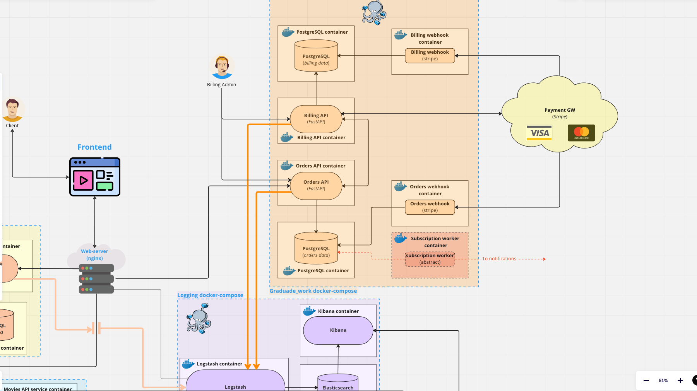

# Проектная работа: диплом
### Тема работы: биллинг.
**URL: https://github.com/HDuh/graduate_work**

---

## Запуск проекта
* > make run
* > make migrate

---

## Схема проекта:

---

## Схема БД:

### Пайплайн:
* Наполнить таблицу **Product**.
* Пользователь на frontend [http://localhost/api/v1/order]  выбирает товар (подписку) для покупки и 
нажимает кнопку **Купить**
* Поступает запрос в Order API на покупку товара. 
Проверку авторизации пользователя выполняет сервис авторизации. В текущей реализации сделан мок.
* Сервис Order API выполняет проверку возможности пользователя купить выбранную им подписку.
Если такая возможность есть, то формируется заказ.
* Сформированный заказ передается на оплату в сервис Billing API.
* Сервис Billing API фиксирует в своей БД информацию о поступившем на оплату заказе.
Запрос на оплату передается в Payment GW, который формирует одноразовую ссылку для оплаты. Пользователя редиректит на страницу оплаты.
* После успешной оплаты рендерится _success page_, если пользователь передумал, то _cancel page_ 
* После процесса оплаты в работу включаются webhook'и. Которые в зависимости от события, обновляют информацию о заказе и оплате в БД.

--- 
TODO:
1. Workers для создания задач и гарантии **Только один раз (exactly once)** для взаимодействия с GW
2. Рассылки пользователям после покупки
3. Взаимодействие между сервисами посредством gRPC
4. Взаимодействия с другими billing GW

### Схема пайплайна оплаты:

